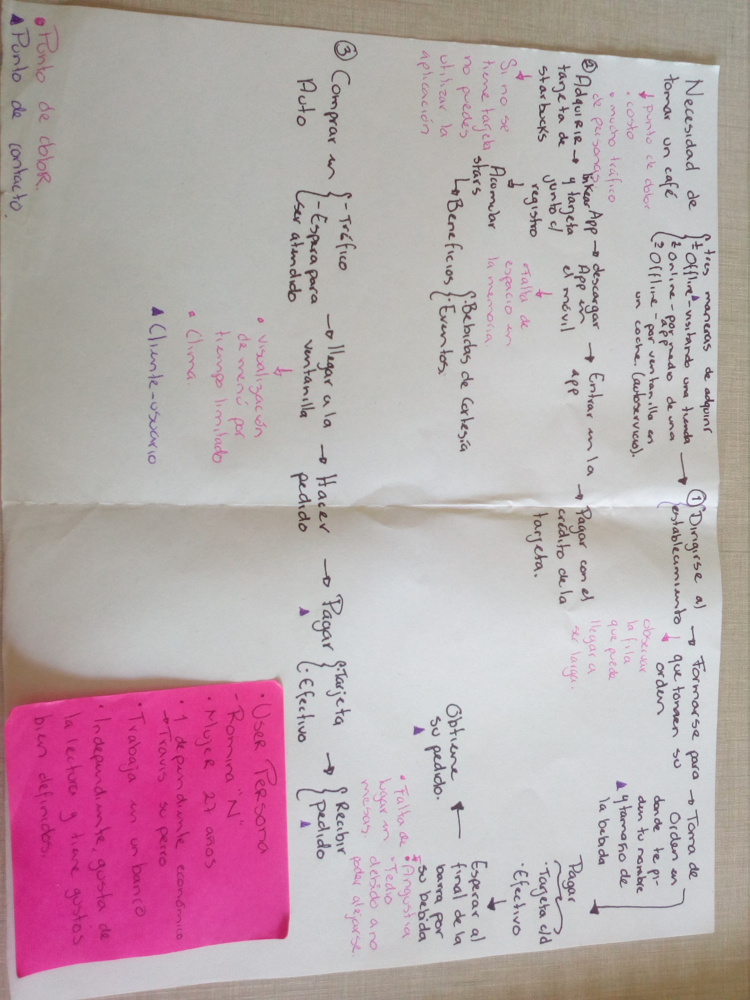

El Customer Journey Map o Mapa de Experiencia de Cliente, es una de las herramientas más interesantes de Design Thinking que ayudan a una empresa mostrando en un plano todas y cada una de las etapas que debe atravesar un cliente para contratar un servicio o comprar un producto.

Para toda empresa el cliente es el eje sobre el que gira su actividad, recursos y expectativas. Una empresa existe por y para sus clientes. Los productos y servicios que las marcas ofrecen serán exitosos o no en función de la acogida que tengan por parte de los clientes ya que serán ellos quienes los compren o los utilicen.

De ahí que sea esencial que tu marca tenga claro su Customer Journey Map. Sólo así podrás cuidar a tus clientes, conociendo en todo momento sus intereses, qué les emociona y qué necesitan de tu empresa.

Sin embargo, muchas empresas se toman a la ligera la importancia de saber cuál ha sido la experiencia de sus clientes para intentar mejorarla, lo que es un gran error. De hecho, todas las estadísticas sobre la experiencia de los usuarios demuestran que para los clientes es sumamente importante una buena experiencia, ya que de lo contrario te abandonarán. Para muestra, los siguientes datos:

El 66% de usuarios que han cambiado de marca lo han hecho por un pobre servicio.
El 91% de los usuarios insatisfechos que no se quejan simplemente abandonan la página web.
El 67% de los usuarios encuentra en una mala experiencia la razón para abandonar.
En la imagen siguiente se muestra el costumer map que se realizó al procedimiento de adquirir un producto de starbucks, existen dos formas de realizarlo offline; la primera es visitando una tienda fisicamente y entrar a ella para adquirir el producto y la segunda es mediante el autoservicio, la otra manera es online mediante la app de starbucks linkeada a una tarjeta preciamente adquirida en un starbucks.
